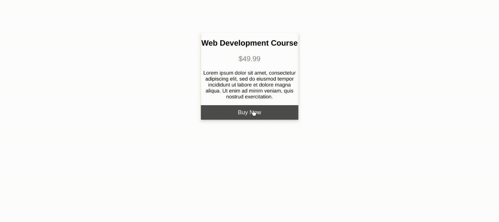
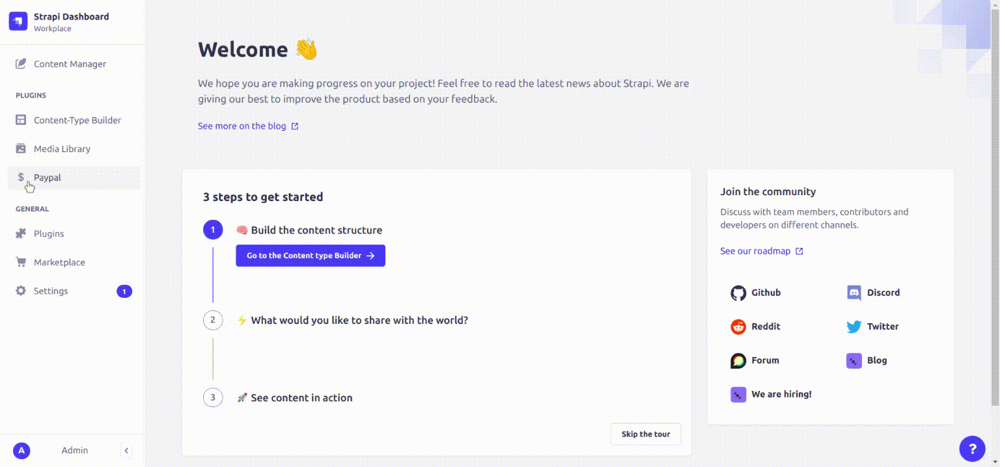

<div align="center">
   
</div>
<h1 align="center">Paypal Payments</h1>
<p align="center">Online payments and subscriptions made simple, secure and fast.</p>
<p align="center">This free plugin enables you to accept online payments and create subscriptions using Paypal account or Credit/Debit card on your Strapi app via Paypal.</p>

<br />

<p align="center">
  <a href="https://www.npmjs.com/package/strapi-paypal">

</a>
<a href="https://www.npmjs.org/package/strapi-paypal">

</a>
<a href="https://github.com/AsyncWeb/strapi-paypal/actions/workflows/eslint.yml/badge.svg">

</a>
</p>

<br>

 <br/>

<br/><br/>

## Paypal Payment plugin for Strapi

[paypal](https://www.paypal.com/) Online payment processing for internet businesses. It's a suite of payment APIs that powers commerce for online businesses of all sizes.

[Strapi](https://strapi.io/) is the leading open-source headless Content Management System. It’s 100% JavaScript, fully customizable and developer-first.

## Overview: Start accepting online payments

The Paypal Payments plugin enables you to accept debit and credit card payments on your Strapi website or app.

Setting up the plugin is super easy and can be completed within 10 minutes.

1. Enter your Paypal API credentials.
1. Create some products, for which the plugin will automtically generate the payment button code.
1. Embed the payment button code on your product listing page.
1. On clicking the payment button, your customer will be redirected to the payment page, securely hosted by Stripe.
1. On making payment, your customer is redirected back to your checkout result page that you can customize.

That's all you need to do to turn your Strapi website or application into an e-commerce site!

<br/><br/>

## ✨ Features

1. Quick installation and setup.
1. Easily accept online payment for any products (or services) you want to sell on your Strapi site.
1. Automatically creates payment buttons for you to embed anywhere on your site.
1. Add multiple “Buy Now” payment buttons on a page.
1. Specify a custom name, description for a product.
1. Customize the message on the checkout result page.
1. Configure the currency type for the payment.
1. Run in test mode for debugging

<br/><br/>

## 🖐 Requirements

The requirements to install the Paypal Payments plugin is the same as those to install Strapi.

Please refer to the official Strapi installation requirement doc here: [Installation Requirements](https://docs.strapi.io/developer-docs/latest/getting-started/introduction.html).

**Minimum environment requirements**

- Node.js `>=14.x.x`
- NPM `>=6.x.x`

We are following the [official Node.js releases timelines](https://nodejs.org/en/about/releases/).

**Supported Strapi versions**:

- Strapi v4.5.0 (recently tested)

- Strapi v4.x

> The Stripe Payments plugin is designed for **Strapi v4.x**. It won't work with Strapi v3.x.

<br/><br/>

## ⏳ Installation

Use **npm** to install this plugin within your Strapi project.

[Refer to this doc to install npm](https://docs.npmjs.com/cli/v6/commands/npm-install)

```bash
npm i strapi-paypal
```

After successful installation please add the below enviornment variables in `.env` files

```bash
PAYPAL_SANDBOX_API_URL=https://api-m.sandbox.paypal.com
PAYPAL_LIVE_API_URL=https://api-m.paypal.com
```

After adding enviornment variables `.env` files, goto Config &gt; `plugins.js` &gt; Add the following code snippet.

```bash
module.exports = ({ env }) => ({
  // ...
  "strapi-paypal": {
    enabled: true,
    config: {
      paypalSandBoxUrl:
        env("PAYPAL_SANDBOX_API_URL") || "https://api-m.sandbox.paypal.com",
      paypalLiveUrl: env("PAYPAL_LIVE_API_URL") || "https://api-m.paypal.com",
    },
  },
  // ...
});

```

Afterwards, you would need to build a fresh package that includes the Translator plugin. For it, please execute the commands below:

```bash
# with npm (option 1)
$ npm run build
$ npm run develop

# with npx (option 2)
$ npx strapi  build
$ npx strapi  develop
```

The **Payment** plugin should appear in the **Plugins** section of the Strapi sidebar after you run the app again.

Now you are ready to accept online payments via Stripe on your Strapi website 🎉

<br/><br/>

## 🔧 Configuration

You can easily configure the Paypal Payments plugin to connect with your Paypal Account.

- Go to ` Settings -> PAYPAL -> Configuration`.
- On the configiration page, Enter All the fields.
- Using `Live Mode` Switch Box, you can easily toggle between Paypal Test and Live mode.
- Click on Save to save the Paypal configuration.

<br/><br/>

<br/><br/>

<br/>

## Create a Product

After configuring Paypal, you can create products.

The products or subscription that you would create via the plugin will also automatically get created in Paypal.

Follow the steps below to create a product:

1. Click on Paypal in the **Plugins** section.
1. Click on Add Product.
1. choose Payment type,One-Time or Subscription.
   - For One-Time, you would charge your customer only one-time.
   - For a subscription, you would charge your customer every month.
1. Enter all the required fields.
1. Click on create button to create a product or subscription.

<br/><br/>

<br/><br/>

<br/>

## Embed Payment Button Code

After creating a product, click on the Embed Code icon.

You would see a popup with easy-to-follow steps, detailed below, to embed the Payment button on your product listing page.

- Embed the script tag to Your product listing, payment success and payment failure pages.
- Embed the Payment Button Code on your product listing page.
- You can customize the text of the Payment Button (example - Buy Now, Pay Now) and style using the appropriate css.

Your product listing page is where you would show all your products for your customers to browse through and purchase. Setting up the product listing page is beyond the scope of this plugin as that would depend on your choice for the frontend.

<br/>

## Accept Online Payments

After you embedding the Payment Button on your product list page, you are ready to accept online payments.

<br/>

<br/>

## 📝 License

[MIT License](LICENSE.md)

Copyright © 2022 [AsyncWeb](https://higheredlab.com/)
